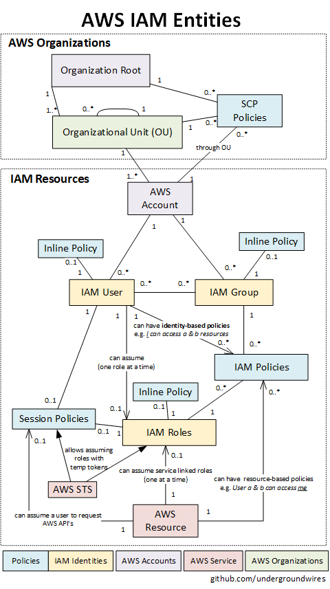

# IAM & Organization

## Account

- Registered with an e-mail address.
  - ❗ Not required for non-root accounts in AWS Organizations
  - *Owner* usually means the e-mail owner of the registered account.
- **Root Account**
  - User with e-mail address that created the account.
  - 💡 Create new user with administrator privileges and remove root account credentials after creating it.

## IAM

- Centralized control of your AWS account.
  - Each API call to AWS is authorized using IAM.
- Shared Access to your AWS account
- Global. Does not apply to regions.
  - So you will use the same IAM configuration no matter if you use one of all regions.
- Identity Federation (including Active Directory, Facebook, LinkedIn, etc.)
- Multifactor Authentication
  - 💡 If your MFA device is lost/damaged/notworking:
    - You can sign in using alternative methods of authentication.
      - E.g. sign in by verifying your identity using the email and phone that are registered with your account.
- Provide temporary access for users/devices and services where necessary
- Supports password policies:
  - Enforce strong password
  - Password rotation policy, e.g. expire after 90 days.
- Credential report: See which users are using what permissions.
- Integrates with many different AWS services
- Supports PCI DSS Compliance
- **IAM Certificate store**: Legacy way to upload certificates, use Certification Manager instead.
- **IAM Query API** to make direct calls to the IAM web service.

### IAM Entities

- 
- **Principal** is an entity in AWS that can perform actions and access resources.
  - **IAM Users**
    - **Programmatic Access: ID + secret**
      - Mostly for machines.
      - 💡 Best practice for services assume roles
      - Assigned and Access Key ID and Secret Key when first created.
      - Secrets are only relieved once, then needs to be regenerated top reveal again.
      - ❗ IDs are permanent you need to manually rotate (make active/disabled, create new etc.)
    - **Console Access: Password**
      - 💡 Ensure no one share users by creating user per person.
  - **IAM Roles**
    - 💡 Use cases:
      - Create roles and can then assign them to AWS resources
      - Give cross-account access to users.
      - Instead of being uniquely associated with one person, a role is intended to be assumable by anyone who needs it.
        - 💡 However for unique access of one you can delegate a role through:
          - In account add *trust policy* that specifies which trusted account members are allowed to assume the role.
          - The *trust policy* specifies which trusted account members (*principal*s) are allowed to assume the role.
    - Credentials are rotated automatically -> Only temporary access.
      - Uses STS with expirations to generate secret id + secret key.
    - You can only assume one role a time
- **IAM Groups**
  - A collection of users under one set of permissions (policies)
  - 💡 Use user groups to assign permissions instead of individual users.
  - A group is not an identity and cannot be identified as a principal in an IAM policy,
- **IAM Policies**
  - JSON document that defines one (or more) permissions
  - **Resource-based**: To supported AWS resources, who can access them.
  - **Identity-based**: Assigned to roles, users, groups, who they can access.
  - Overlap => Deny overrides allow.
  - To define resources ARN's are used (Amazon Resource Names) to uniquely identify AWS resources
  - 💡 Principal of Least Privilege: Permit no more than resources/actions to do the job.

#### IAM Authentication to Services

- Most of AWS services authenticates a user / role.
- User / role (IAM) credentials must be sent in header
  - It's called Sig v4 **AWS Signature Version 4 Signing Process**
  - You sign all requests with signed using an access key (derivation of access key ID + secret access key) in header
- All requests to AWS API's are signed automatically by SDK/CLI.

## AWS Organizations
  
- Consolidate multiple AWS accounts into an organization that you create and centrally manage
  - Enforce (SCP) policies centrally on root or OU's.
- Grouping all of your AWS accounts into **Organizational Units** (OUs) as part of a hierarchy
  - Hierarchical based control over groups of IAM users and roles, within multiple Accounts.
- Allows **Consolidated billing**: Multiple standalone accounts are combined and may reduce your overall bill
  - They can still be tracked individually and the cost data can be downloaded in a separate file.
- Allows you to create accounts programmatically.
